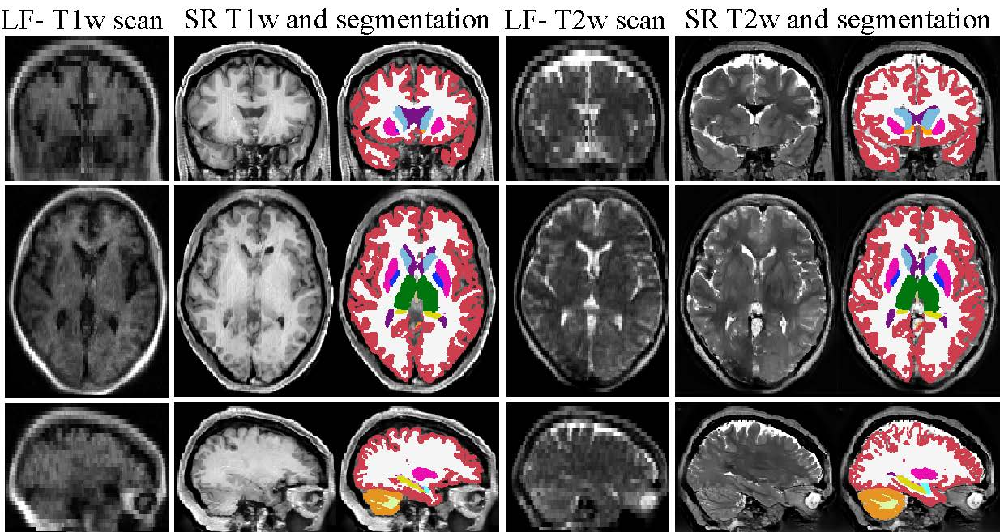

# Super-resolution of portable low-field MRI in real scenarios: integration with denoising and domain adaptation
##### Presented at MIDL 2022: [Super-resolution of portable low-field MRI in real scenarios: integration with denoising and domain adaptation](https://openreview.net/forum?id=pinw0Gcot4T)
##### Sonia Laguna - ETH Zurich
##### Work carried out at the Athinoula A. Martinos Center for Biomedical Imaging, Boston, USA

In this repository, we present a method to super resolve clinical low-field MRI data leveraging information from large amounts of existing high-resoution data to apply it on low resolution scans, we particularly use data from the HCP (See [manuscript](https://openreview.net/forum?id=pinw0Gcot4T) for more details).

An example of the results of our method can be seen below. 

---
The steps to apply our method are described below:
### 0. Installation: Environment setup prior to experiments
1. Clone this repository
2. Create a virtual environment, and install the required packages (see [requirements](requirements_SR.txt)). Run  `pip install -r requirements.txt`

### 1. Datasets 
The data used in this project came from clinical scans using a Hyperfine scanner, as well as data coming from the Human Connectome Project (HCP). The HCP data was used at a resolution of 1x1x1 mm, as it is the desired for most MRI analysis tools. The script `./processing/im_extraction_HCP.py` was used to generate and preprocess the train and test datasets. This HCP data will be synthetically degraded to simulate low-field data throughout the different training batches in each model.
This meta-architecture is divided in modules that are trained on different data-types. Note that one has to train the models separately for T1 data and T2 depending on the desired set. The data paradigm in each module is the following:
- `Denoiser`:
  - It is trained on synthetic low resolution noisy data and low resolution clean data as target.
  - The input to this submodule is high-resolution HCP data that will be degraded in the implementation accordingly and explained throughout the code.
- `Super-Resolution`:
  - It is trained on synthetic low resolution clean data and uses high resolution HCP data as target.
  - The input to this submodule is high-resolution HCP data that will be degraded in the implementation accordingly and explained throughout the code.
  
- `Domain adaptation`:
  - It is trained on clinical low-field data and uses synthetic low resolution degraded data as target.
  - The input to this submodule includes both datasets: clinical low-field data and high-resolution HCP data that is degraded in the implementation accordingly.
  
`Final finetuning`:  The meta-architecture is trained end-to-end combining all modules in a supervised unpaired way. It takes clinical low-field data as input and uses high-resolution HCP data as target. 

### 2. Train Super Resolution meta-architecture.
To train the network, one needs to train module by module in the steps described below. An example of a model at each step can be found in the directory `model_example`.

####Step 1

- `Denoiser`: 
To train the network, specify the data paths `train_dir` and `seg_dir` in the file `/denoising_3D/train.py`. These correspond to the directories with the HCP data and its segmentation. Finally, the name of the experiment can be defined in `out_path`. Run `./denoising_3D/train.py` to train this module. 
To do inference on the model, specify the data paths `test_dir` and `seg_dir` in the file `/denoising_3D/test.py`. These correspond to the directories with the HCP data and its segmentation. Finally, the name of the result directory can be defined in `out_path`. Run `./denoising_3D/test.py` to test this module.  

- `Super-Resolution`:To train the network at this step, ensure that the parameters in the training [config](./BasicSR-master_3D/options/train/ESRGAN/train_ESRGAN_x4_sonia.yml) file: `cycle` ,`cut` and `denois` are set to false.  Set the data directories in the training [config](./BasicSR-master_3D/options/train/ESRGAN/train_ESRGAN_x4_sonia.yml) file: `datasets/train/dataroot_gt`, directory with high resolution HCP data, will be degraded to the corresponding low-resolution pair; `datasets/train/dataroot_seg`, directory with segmentations of the high-resolution HCP data, used for segmentation based intensity mask in data augmentation . See a more detailed description in the following [readme](./BasicSR-master_3D/README.md).
From the directory `BasicSR-master_3D`, run `python ./basicsr/train.py -opt ./options/train/ESRGAN/name_of_train_config.yml` to train this module. 
From the directory `BasicSR-master_3D`, run `python ./basicsr/test.py -opt ./options/test/ESRGAN/name_of_test_config.yml` to test this module. 

- `Domain adaptation`: Two alternatives have been studied in this project, both need the user to create a data folder including `testA`, `testB`, `trainA` and `trainB` directories with the datasets where folders A correspond to the low-field MRI data and folders B to the synthetically generated data: 
  - FastCUT: To train the network, inside of the directory `contrastive-unpaired-translation-master_3D`, run `python train.py  --dataroot /directory/to/data_folder  --name define_name --CUT_mode FastCUT   --input_nc 1 --output_nc 1 --batch_size 1   --num_threads 8 --normG batch --normD batch  --netG resnet_6blocks --no_flip --display_port 10001` to train the model.
To test it, run `python test.py  --dataroot /directory/to/data_folder  --name  name_of_model_toinference --CUT_mode FastCUT   --input_nc 1 --output_nc 1  --num_threads 8 --normG batch --normD batch  --netG resnet_6blocks --epoch num_desired_epochs`.  See [README](./contrastive-unpaired-translation-master_3D/README.md) for more details. 
  - CycleGAN: To train the network, inside of the directory `pytorch-CycleGAN-and-pix2pix-master_3D`, run `python train.py --dataroot /directory/to/data_folder --name define_name  --model cycle_gan   --input_nc 1 --output_nc 1 --batch_size 1   --num_threads 8  --netG resnet_6blocks  --norm batch  --no_flip --display_port 10003`. To test it, run `python test.py --dataroot /directory/to/data_folder --name  name_of_model_toinference --model cycle_gan  --input_nc 1 --output_nc  1  --num_threads 8 --norm  batch --netG resnet_6blocks  --num_test 100000000  --epoch num_desired_epochs`. See [README](./pytorch-CycleGAN-and-pix2pix-master_3D/README.md) for further details on this implementaiton. 

Note that, after this point, the remaining neural network methodology will be done using the `BasicSR-master_3D` directory only. 
####Step 2
- `Denoiser + Super-Resolution`: This part requires to load the denoiser and super-resolution models trained on Step 1 and retraining them in a concatenated fashion. To train this new combination the user needs to modify the options .yaml [file](./BasicSR-master_3D/options/train/ESRGAN/train_ESRGAN_x4_sonia.yml) from the `BasicSR-master_3D`directory. In such file, specific parameters need to be set: `datasets/(test_1/train)/denois` will be set to True, `datasets/train/model_sr` includes the name of the pretrained model of super-resolution in Step 1, `datasets/train/epoch_sr` includes the number of the epoch corresponding to `model_sr`,  `datasets/train/model_d` with the name of the pretrained model of denoising in step 1 with the corresponding `epoch_d`. Once the options file is set, run `python ./basicsr/train.py -opt ./options/train/ESRGAN/name_of_train_config.yml` to train this module and run `python ./basicsr/test.py -opt ./options/test/ESRGAN/name_of_test_config.yml` to test it, with `denois` as True in the testing config file too.    

####Step 3
- Final end-to-end finetuning, `Domain adaptation + Denoiser + Super-Resolution`: This part requires to load the denoiser and super-resolution concatenated model from step 2 and the domain adaptation models from Step 1 to train them together in a concatenated fashion.  To train this new combination the user needs to modify the options .yaml [file](./BasicSR-master_3D/options/train/ESRGAN/train_ESRGAN_x4_sonia.yml) from the `BasicSR-master_3D`directory. In such file, specific parameters need to be set: `datasets/(test_1/train)/denois` will be set to False, `datasets/(test_1/train)/cycle` will be set to True if working with the CycleGAN and `datasets/(test_1/train)/cut` will be set to True if working with FastCUt, `datasets/train/model_dsr` needs to include the name of the pretrained model of super-resolution and denoising in Step 2, `datasets/train/epoch_dsr` includes the number of the epoch corresponding to `model_dsr`,  `datasets/train/(model_da/model_daf)` with the name of the pretrained model of domain adapatation for CycleGAN/FastCUT in step 1 with the corresponding `epoch_da/epoch_daf`. Finally, we are using the parameter `datasets/train/dataroot_lq` for the first time, it includes the low-field MRI data for unpaired learning. Once the config file is set, run `python ./basicsr/train.py -opt ./options/train/ESRGAN/name_of_train_config.yml` to train this module and run `python ./basicsr/test.py -opt ./options/test/ESRGAN/name_of_test_config.yml` to test it, with `denois` as False and `cycle/cut` as True in the testing config file too.    

### 3. Evaluate the trained model. 
To evaluate the overall network, as in Step 3 above, modify the options test [file](./BasicSR-master_3D/options/test/ESRGAN/test_ESRGAN_x4_woGT_sonia.yml) with the corresponding cycle or cut parameter as true if we are working with CycleGAN or FastCUT. The directory of the model to evaluate is set in `path/pretrain_network_g` and the data directory to study is found in `datasets/test_1/dataroot_lq`

### 4. Evaluation of the methodology

For evaluation of the proposed methodology, we used the clinical low-field dataset and the expected ground truth corresponds to the high-field data coming from the same subjects. Note that this method cannot be trained in a supervised fashion with this ground truth due to the nonlinear geometric distorsions. 
We studied the segmented scans coming from the output of the method and the ground truths. To segment the frames we used a robust approach embedded in FreeSurfer, `SynthSeg`, see [manuscript](https://openreview.net/pdf?id=Qz2DgRQGlP). 

We computed the ROI volumes from the segmentations and used the correlation between the estimated outputs and the ground truth as a proxy for performance of the method using the script `./processing/compute_metrics_MIDL.py`. The directory `processing/data_hyp`includes the results from SythSeg used in this project. 
